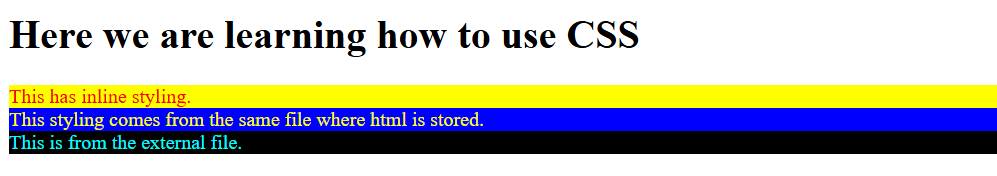

# How to use CSS ?

- There are three ways to use CSS.

## 1. Inline styling

- Here we would would styling the tag itself which requires styling.
- Inline styling takes precedence over any other way to style.

### Example:

```html
<div style="background-color: yellow; color: red;">
	This has inline styling.
</div>
```

## 2. Styling in same document

- Here, we would be using a `<style>` tag in the same file where HTML is stored.
- This has lower precendence compared to the Inline styling.
- We can write it in `<head>` or `<body>` tag.

### Example:

```html
<style>
	div {
		background-color: blue;
		color: yellow;
	}
</style>
---
<div>
	This styling comes from the same file where html is stored.
</div>
```

## 3. External styling

- Here, we would be having a separate file for the styling purpose.
- We would be importing the file using `<link>` tag.

### Example:

```html
<link rel="stylesheet" href="./001_ExternalFile.css">
---
<div id="some-div">
	This is from the external file.
</div>
```

```css
#some-div {
	background-color: black;
	color: aqua;
}
```

---

How it's visible:

