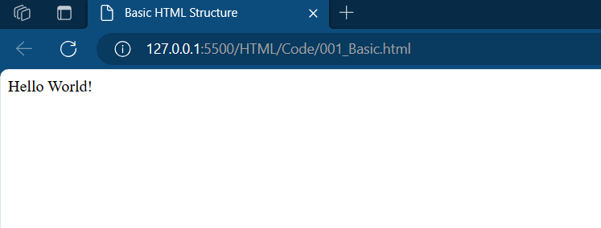

# Basic HTML Structure

1. Create a file with below code:

```html
<!DOCTYPE html>
<html>
<head>
	<title>Basic HTML Structure</title>
</head>
<body>
	Hello World!
</body>
</html>
```

2. Save the file with `.html` extension.
3. Open the file in the browser.
4. Page would be visible as below:

