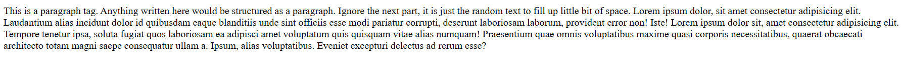

# Few Common Things 

- `<p>`

Code:

```html
<p>This is a paragraph tag. Anything written here would be structured as a paragraph. Ignore the next part, it is just the random text to fill up little bit of space. Lorem ipsum dolor, sit amet consectetur adipisicing elit. Laudantium alias incidunt dolor id quibusdam eaque blanditiis unde sint officiis esse modi pariatur corrupti, deserunt laboriosam laborum, provident error non! Iste! Lorem ipsum dolor sit, amet consectetur adipisicing elit. Tempore tenetur ipsa, soluta fugiat quos laboriosam ea adipisci amet voluptatum quis quisquam vitae alias numquam! Praesentium quae omnis voluptatibus maxime quasi corporis necessitatibus, quaerat obcaecati architecto totam magni saepe consequatur ullam a. Ipsum, alias voluptatibus. Eveniet excepturi delectus ad rerum esse?</p>
```

How it's visible:



---

- Comments

Code:

```html
<!-- This part will not be visible on the browser -->
```

## Attributes

- Attributes are something which give little more information about the tag.
- They might have multiple values, few list of values from which it can be selected, without values but still serving the purpose.
- Few common general attributes are `name`, `id`.
- Multiple tags can have same `name` value. It can be used with group or single tag.
- Every `id` attribute have unique value per tag.