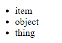
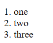

# Lists

## Unordered List

Code:
```html
<ul>
	<li>item</li>
	<li>object</li>
	<li>thing</li>
</ul>
```

How it's visible:



## Ordered List

Code:
```html
<ol>
	<li>one</li>
	<li>two</li>
	<li>three</li>
</ol>
```

How it's visible:

