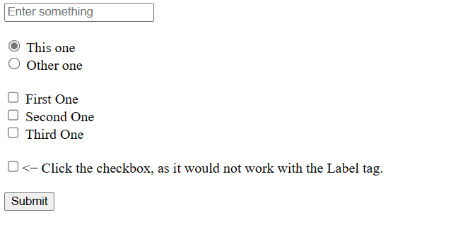

# ` <form> `

- Form is used to capture the details and redirect or store the data at other place
- Form would have an `action` attribute which would be the lace where it shoud redirect with the collected data.

## ` <input> `

- Input is the tag used to capture some sort of information from user.

### Attributes in ` <input> `

- Input would have the attribute ` type ` to specify what type of data is to be collected.
  - `type` attribute can have few selected values like `text`, `radio`, `checkbox`, etc,.
  -  ` type="text" ` would be used to get the text data.
  -  ` type="radio" ` would be used to select only one radio button out of all.
  -  ` type="checkbox" ` would be used to select multiple values out of all.

- When `text` is the value of `type`, in those cases there can be other attribute like `placeholder` whose value could be some text that can be displayed till something is enter as text.

- `required` attribute is one without any values. When used, it indicates the value should be present before submitting the form or else would give an error. 

- When `radio`, `checkbox` is the value of `type`, in those cases we can have one other attribute `checked` which would selected by default.

- All the `radio` or `checkbox` values should have same name in `name` attribute, this is to ensure only one radio button is selected or from what group of checkbox the data is fetched.

- All the tag should have differnt `id` if any present.
  
## ` <label> `

- Used to label something(address something with some sort of name).
- When used with `radio` or `checkbox` would allow to click on the value present in the entire label tag to get it selected.

### Attributes in ` <label> `

- `for` attribute, it's value should be same as the `id` of the tag to associate `input` and `label` tags.

How it's visible:

