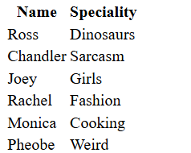

# `<table>`

- Table is used to show some content in a form of a table.

## `<tr>`

- It is one inner tag of the table representing a table row.
- It has inner tags like `<th>` and `<td>` representing table heading and table data resectively.

Code:
```html
<table>
	<tr>
		<th>Name</th>
		<th>Speciality</th>
	</tr>
	<tr>
		<td>Ross</td>
		<td>Dinosaurs</td>
	</tr>
	<tr>
		<td>Chandler</td>
		<td>Sarcasm</td>
	</tr>
	<tr>
		<td>Joey</td>
		<td>Girls</td>
	</tr>
	<tr>
		<td>Rachel</td>
		<td>Fashion</td>
	</tr>
	<tr>
		<td>Monica</td>
		<td>Cooking</td>
	</tr>
	<tr>
		<td>Pheobe</td>
		<td>Weird</td>
	</tr>
</table>
```

How it's visible:

